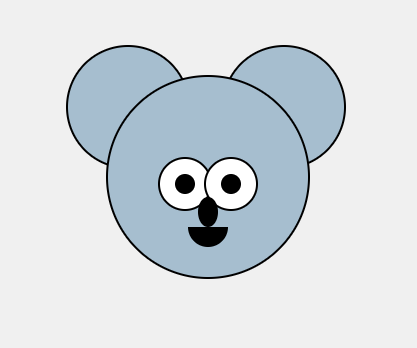

# Использование `absolute` позиционирования

## Цель:

Нарисуйте коалу с помощью HTML и CSS

<p align="center">

</p>

### Использованные цвета

#A6BECF

### Стартовый CSS

```CSS
body {
    display: flex;
    justify-content: center;
    align-items: center;
    height: 100vh;
    margin: 0;
}

.koala {
    position: relative;
}
```

# Теория

## Виды позиционирования — контекст

Прежде чем разбирать `absolute`, важно понимать всю систему:

| Значение | Описание |
|---|---|
| `static` | По умолчанию. Элемент в нормальном потоке. `top/left` не работают |
| `relative` | В потоке, но можно смещать через `top/left`. Создаёт контекст для `absolute` |
| `absolute` | Вырван из потока. Позиционируется относительно предка |
| `fixed` | Вырван из потока. Позиционируется относительно **viewport** |
| `sticky` | Гибрид `relative` и `fixed` |

---

## Как работает `position: absolute`

### Шаг 1 — Элемент вырывается из потока
Остальные элементы его **не замечают** — они заполняют пространство, как будто абсолютного элемента нет.

### Шаг 2 — Поиск точки отсчёта
Браузер идёт вверх по DOM и ищет первого предка, у которого `position` **не `static`** (`relative`, `absolute`, `fixed`, `sticky`). Этот предок становится **containing block** (блоком-контейнером).

### Шаг 3 — Позиционирование
Через `top`, `right`, `bottom`, `left` элемент размещается внутри найденного предка.

```
Если подходящий предок НЕ найден → точка отсчёта = <html> (весь документ)
```

---

## Основные свойства

```css
.child {
  position: absolute;
  top: 20px;      /* отступ от верхнего края предка */
  right: 10px;    /* отступ от правого края предка */
  bottom: 0;      /* отступ от нижнего края предка */
  left: 50%;      /* отступ от левого края предка */
  z-index: 10;    /* порядок наложения */
}
```

> `top` и `bottom` одновременно — работают, но `top` имеет приоритет, если не задана высота.  
> `left` и `right` одновременно — работают, но `left` имеет приоритет, если не задана ширина.

---

## Главный паттерн: родитель + ребёнок

Самое частое применение — **разместить элемент внутри другого**.

```css
/* Шаг 1: родителю даём relative */
.parent {
  position: relative;
}

/* Шаг 2: ребёнку даём absolute */
.child {
  position: absolute;
  top: 10px;
  right: 10px;
}
```

```html
<div class="parent">
  <div class="child">Я позиционирован относительно родителя</div>
</div>
```

> Без `position: relative` на родителе — `.child` улетит позиционироваться относительно `<html>`!

---

## Центрирование с `position: absolute`

### Горизонтальное и вертикальное (классический способ)

```css
.parent {
  position: relative;
}

.child {
  position: absolute;
  top: 50%;
  left: 50%;
  transform: translate(-50%, -50%);
}
```

> `top: 50%` и `left: 50%` — смещают **верхний левый угол** элемента в центр.  
> `transform: translate(-50%, -50%)` — сдвигают элемент назад на половину его собственного размера.

### Растянуть на весь родительский блок

```css
.child {
  position: absolute;
  top: 0;
  right: 0;
  bottom: 0;
  left: 0;
  /* или короче: */
  inset: 0;
}
```

---

## Свойство `inset` (современный способ)

`inset` — это шортхенд для `top + right + bottom + left`:

```css
/* Полная запись */
.el { top: 10px; right: 20px; bottom: 10px; left: 20px; }

/* Через inset */
.el { inset: 10px 20px; }   /* вертикаль горизонталь */
.el { inset: 0; }            /* все стороны = 0 */
```

---

## z-index и порядок наложения

`z-index` работает **только** на позиционированных элементах (`relative`, `absolute`, `fixed`, `sticky`).

```css
.below { position: absolute; z-index: 1; }
.above { position: absolute; z-index: 2; }  /* поверх */
```

### Stacking Context (контекст наложения)
Новый контекст наложения создаётся при:
- `position: relative/absolute` + `z-index` ≠ `auto`
- `position: fixed` или `sticky`
- `opacity` < 1
- `transform`, `filter`, `will-change`

> Элемент с `z-index: 9999` внутри родителя с `z-index: 1` **никогда не окажется поверх** элемента с `z-index: 2` вне этого родителя.

---

## Влияние на размер элемента

Абсолютно позиционированный элемент по умолчанию **сжимается до размера содержимого** (ведёт себя как `inline`).

```css
/* Явно задать размер */
.child {
  position: absolute;
  width: 200px;
  height: 100px;
}

/* Или растянуть через left + right */
.child {
  position: absolute;
  left: 0;
  right: 0;    /* ширина = ширина предка */
}
```

> Документация: [MDN — position](https://developer.mozilla.org/ru/docs/Web/CSS/position)

# Как сдавать

- Создайте форк репозитория в вашей организации с названием-этого-репозитория-вашафамилия
- Используя ветку wip сделайте задание
- Зафиксируйте изменения в вашем репозитории
- Когда документ будет готов - создайте пул реквест из ветки wip (вашей) на ветку main (тоже вашу) и укажите меня (ktkv419) как reviewer

Не мержите сами коммит, это сделаю я после проверки задания

